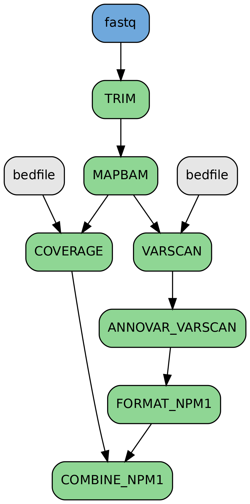
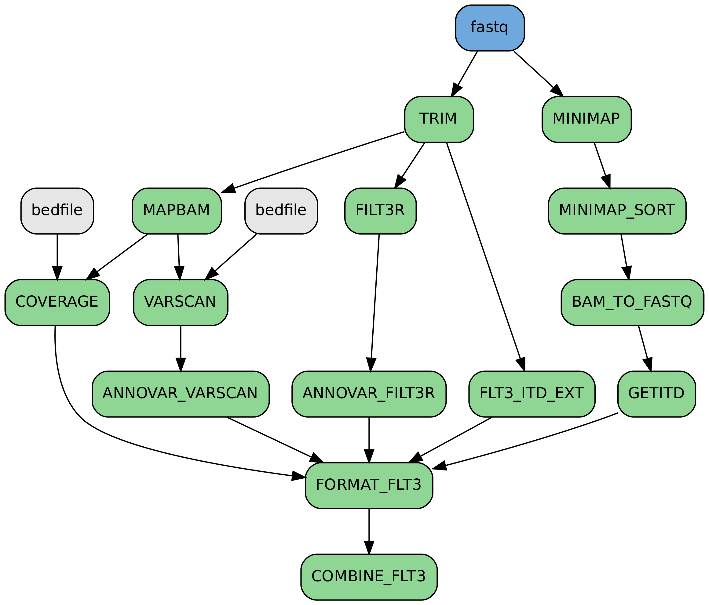

# NPM1-FLT3 detection

This nextflow pipeline contains 2 workflows
- NPM1_MRD - Detection of NPM1 mutations in MRD samples.

<p align="center">

</p>

- FLT3_MRD - Detection of FLT3 mutations in MRD samples.

<p align="center">

</p>

### Tools

- Trimming = trimmomatic
- Alignment = bwa mem | minimap2
- Sorting, Indexing = samtools 
- Coverage calculation = bedtools
- Variant calling = varscan
- FLT3 ITD detection = filt3r | getITD | FLT3_ITD_ext
- Annotation = ANNOVAR

## Usage


The following parameters need to be modified in the `params` section of the `nextflow.config` -

- **genome** = Complete path to the human genome fasta file(hg19_all.fasta). Please ensure the FASTA index file(hg19_all.fasta.fai) and BWA index files(hg19_all.fasta.amb, hg19_all.fasta.ann, hg19_all.fasta.bwt, hg19_all.fasta.pac, hg19_all.fasta.sa) are also present in the same genome folder

- **bedfile** = Complete path to the bedfile containing target regions

- **illumina_adapters** = Complete path to the fasta file containing Illumina TruSeq adapter sequences

- **nextera_adapters** = Complete path to the fasta file containing Nextera adapter sequences

- **filt3r_ref** = Complete path to the reference fasta file for Filt3r

- **genome_minimap_getitd** = Complete path to the Human reference genome for Minimap2 (hg37.fa)

- **annovar_humandb** = Complete path to the humandb database folder for ANNOVAR (refer https://annovar.openbioinformatics.org/en/latest/user-guide/startup/ )

- **outdir** = Complete path to the output directory

## Running the pipeline

1. Transfer the `fastq.gz` files to the `sequences/` folder.

2. The samplesheet is `samplesheet.csv`. The sample ids, without the file extension, should be mentioned in samplesheet in the following format - <br>
sample1<br>
sample2<br>
sample3<br>
Please check for empty lines in the samplesheet before running the pipeline.


3. The pipeline can be executed with the following command
<br>

#### For running the NPM1_MRD workflow -
```bash
nextflow main.nf -entry NPM1_MRD -profile docker -resume -bg
```

#### For running the FLT3_MRD workflow -
```bash
nextflow main.nf -entry FLT3_MRD -profile docker -resume -bg
```
